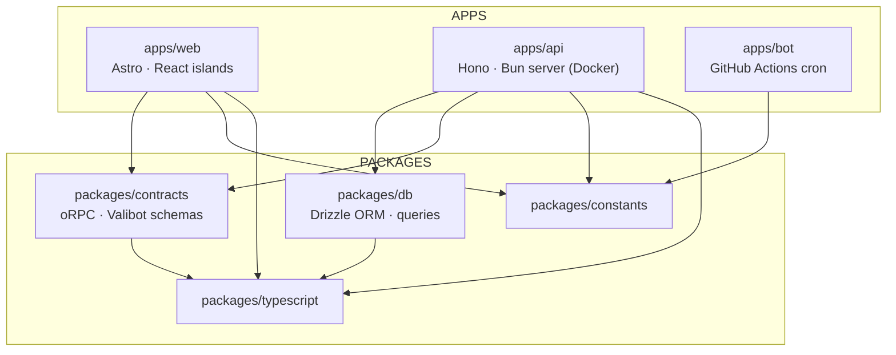
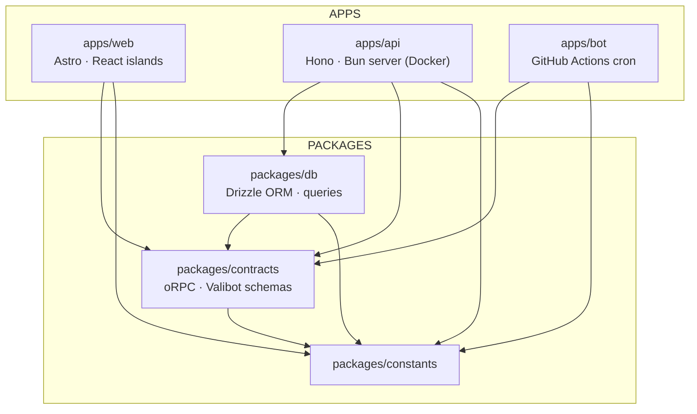
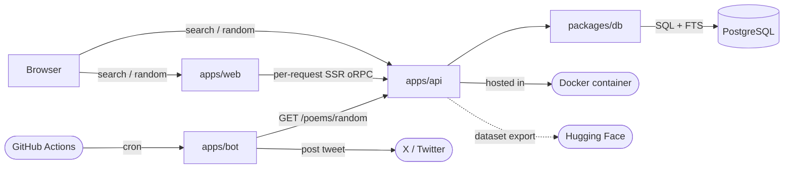
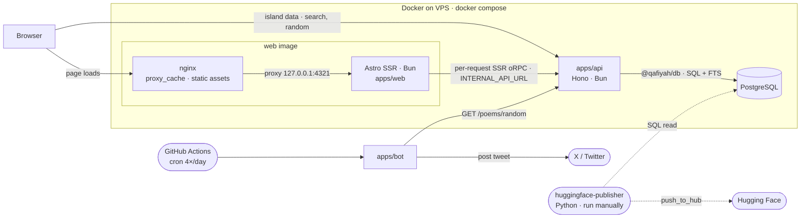

# README Architecture Section Accuracy Implementation Plan

> **For agentic workers:** REQUIRED SUB-SKILL: Use superpowers:subagent-driven-development (recommended) or superpowers:executing-plans to implement this plan task-by-task. Steps use checkbox (`- [ ]`) syntax for tracking.

**Goal:** Make the README "Architecture" section (lines 144–201) — its directory tree and both Mermaid charts — match the actual codebase exactly.

**Architecture:** This is a documentation-correctness task. The "tests" are `grep`/`find` commands that read the codebase as the source of truth: each task first proves the README currently disagrees with the code, then applies the fix, then proves the README now agrees. One dead config file is deleted so the tree stays accurate. No application code changes.

**Tech Stack:** Markdown + Mermaid (GitHub-rendered), Bun + Turborepo monorepo, Biome + Prettier formatting.

---

## Background: ground truth gathered from the codebase

These facts were verified before writing the plan and drive every correction below. Re-verify them with the commands in each task.

**Real workspace imports (from `grep -rhoE "from '@qafiyah/[a-z]+" <ws>/src`):**

| Source workspace | Imports (`@qafiyah/*`) in source |
| ---------------- | -------------------------------- |
| `apps/web`       | contracts, constants             |
| `apps/api`       | db, contracts, constants         |
| `apps/bot`       | contracts, constants             |
| `packages/db`    | contracts, constants             |
| `packages/contracts` | constants                    |
| `packages/constants` | (none)                       |

`packages/typescript` is **not imported** by anyone — every workspace consumes it via `tsconfig.json` `"extends": "@qafiyah/typescript/<preset>.json"` (`web`→astro, `api`/`bot`→bun, `db`/`contracts`/`constants`→base).

**`packages/typescript` contents:** `astro.json`, `base.json`, `bun.json`, **`cloudflare.json`**. The `cloudflare.json` preset is dead — no `tsconfig.json` extends it (the project migrated off Cloudflare to a VPS). Its only references are a historical plan doc and a VS Code spellcheck word.

**Hugging Face export reality:** there is **no** Hugging Face code anywhere in `apps/`. The export is `tools/huggingface-publisher/publish.py` — a standalone Python script that connects **directly to PostgreSQL** (`sqlalchemy.create_engine` + `pandas.read_sql`) and uploads with `datasets` `push_to_hub`. It is run **manually** (`python publish.py`); there is no GitHub Actions workflow for it. It never calls the API.

**Deployment topology (`docker-compose.yml` + `docs/DEPLOYMENT.md`):** `docker compose up -d --build` runs three containers on a VPS — `db` (PostgreSQL), `api` (Hono/Bun, `:8787`), and `web`. The `web` image bundles **nginx** (proxy_cache + static assets, `:80`) in front of the Astro SSR server (Bun, `127.0.0.1:4321`). SSR reaches the API via `INTERNAL_API_URL=http://api:8787`; browser islands hit the public API (`PUBLIC_API_URL` unset → prod fallback). The bot runs in GitHub Actions (outside the VPS) and hits the public API.

**Decisions locked for this plan:**
1. Package-dependency graph: **drop the `typescript` node** (it is extended, not imported); note the shared tsconfig in prose.
2. Runtime data-flow graph: **fuller deployment view** — a "Docker on VPS" subgraph with nginx in front of web, plus a `huggingface-publisher` node reading PostgreSQL.
3. `cloudflare.json`: **delete it** so the README's "(base, astro, bun)" stays accurate.

---

## File Structure

- **Modify:** `README.md` — the Architecture section only (package-dependency Mermaid graph + a new prose line; runtime data-flow Mermaid graph + its prose paragraph). The directory tree's `typescript/` line needs **no** edit once `cloudflare.json` is deleted.
- **Delete:** `packages/typescript/cloudflare.json` — dead tsconfig preset.

Sections of the README confirmed **accurate** and intentionally left untouched: line 146 ("three apps and four shared packages"); the directory-tree descriptions for `web`/`api`/`bot`/`db`/`contracts`/`constants`; and the "Two architectural constraints" paragraph (db-isolation + `lib/server`/`lib/api` split — both verified true).

---

### Task 1: Delete the dead `cloudflare.json` tsconfig preset

**Files:**
- Delete: `packages/typescript/cloudflare.json`
- Verify (no edit): `README.md:158` already reads `Shared TypeScript configs (base, astro, bun)`

- [ ] **Step 1: Prove the file is dead (the "failing test")**

Run:

```bash
grep -rn "typescript/cloudflare" apps packages --include="*.json"
```

Expected: **no output** — confirms no `tsconfig.json` extends the `cloudflare` preset, so deleting it is safe.

- [ ] **Step 2: Confirm the only references are non-code**

Run:

```bash
grep -rln "cloudflare" packages docs .vscode 2>/dev/null
```

Expected: matches only `packages/typescript/cloudflare.json` (the file itself), `docs/superpowers/plans/2026-05-20-containerize-api-web.md` (historical), and `.vscode/settings.json` (spellcheck dictionary). No live tsconfig.

- [ ] **Step 3: Delete the file**

Run:

```bash
git rm packages/typescript/cloudflare.json
```

Expected: `rm 'packages/typescript/cloudflare.json'`.

- [ ] **Step 4: Prove nothing broke (the "passing test")**

Run:

```bash
bun run types
```

Expected: PASS for all workspaces. Nothing extended the deleted preset, so type-checking is unaffected.

- [ ] **Step 5: Confirm the README tree line is now accurate**

Run:

```bash
grep -n "Shared TypeScript configs" README.md
```

Expected: `Shared TypeScript configs (base, astro, bun)` — now lists exactly the three remaining presets. No edit needed.

- [ ] **Step 6: Commit**

```bash
git add -A
git commit -m "$(cat <<'EOF'
chore(typescript): remove unused cloudflare tsconfig preset

Nothing extends it; web moved off Cloudflare to a VPS.

Co-Authored-By: Claude Opus 4.7 (1M context) <noreply@anthropic.com>
EOF
)"
```

---

### Task 2: Correct the package-dependency Mermaid graph

The current graph shows `BOT --> CONSTANTS`, `DB --> TS`, `CONTRACTS --> TS` — understating real imports. The corrected graph reflects actual `@qafiyah/*` source imports and drops the `typescript` node (consumed via `extends`, not imports), with a prose note in its place.

**Files:**
- Modify: `README.md` (the ` ```mermaid ` `graph TD` block at lines ~163–181)

- [ ] **Step 1: Re-derive the true edges from source (the spec)**

Run:

```bash
for ws in apps/web apps/api apps/bot packages/db packages/contracts packages/constants; do
  echo "== $ws =="; grep -rhoE "from '@qafiyah/[a-z]+" "$ws/src" 2>/dev/null | sort -u
done
```

Expected:

```
== apps/web ==
from '@qafiyah/constants
from '@qafiyah/contracts
== apps/api ==
from '@qafiyah/constants
from '@qafiyah/contracts
from '@qafiyah/db
== apps/bot ==
from '@qafiyah/constants
from '@qafiyah/contracts
== packages/db ==
from '@qafiyah/constants
from '@qafiyah/contracts
== packages/contracts ==
from '@qafiyah/constants
== packages/constants ==
```

This is the exact edge set the graph must encode: `web→{contracts,constants}`, `api→{db,contracts,constants}`, `bot→{contracts,constants}`, `db→{contracts,constants}`, `contracts→{constants}`, `constants→∅`.

- [ ] **Step 2: Prove the README graph currently disagrees (the "failing test")**

Run:

```bash
grep -nE 'BOT --> CONSTANTS$|DB --> TS$|CONTRACTS --> TS$' README.md
```

Expected: three matches — the understated/incorrect edges are present.

- [ ] **Step 3: Replace the graph and add the tsconfig note**

In `README.md`, replace this exact block:

````markdown

````

with:

````markdown


`packages/typescript` isn't shown above: it ships shared tsconfig presets (`base`, `astro`, `bun`) that every workspace consumes through `extends`, not via code imports.
````

- [ ] **Step 4: Normalize markdown formatting**

Run:

```bash
bun run format
```

Expected: Prettier may reflow `README.md`; everything else is already formatted.

- [ ] **Step 5: Prove the README graph now matches source (the "passing test")**

Run:

```bash
grep -nE 'BOT --> CONTRACTS & CONSTANTS|DB --> CONTRACTS & CONSTANTS|CONTRACTS --> CONSTANTS' README.md
grep -nE '"packages/typescript"|& CONSTANTS & TS|BOT --> CONSTANTS$|DB --> TS$|CONTRACTS --> TS$' README.md
```

Expected: the first command prints three corrected edge lines; the second command prints **nothing** (the `TS` node and all old/incorrect edges are gone).

- [ ] **Step 6: Visually confirm the diagram renders**

Open `README.md` in a Mermaid preview (VS Code Markdown preview, or GitHub). Confirm: no parse error; nodes are `WEB API BOT` (APPS) and `DB CONTRACTS CONSTANTS` (PACKAGES); arrows match Step 1's edge set; no `packages/typescript` node.

- [ ] **Step 7: Commit**

```bash
git add README.md
git commit -m "$(cat <<'EOF'
docs(readme): correct package-dependency graph to real imports

Add missing bot/db/contracts edges; drop the typescript node
(extended via tsconfig, not imported).

Co-Authored-By: Claude Opus 4.7 (1M context) <noreply@anthropic.com>
EOF
)"
```

---

### Task 3: Correct the runtime data-flow Mermaid graph and its prose

The current graph claims `API -.->|"dataset export"| HF`, which is wrong — the export reads PostgreSQL directly via a standalone Python tool. It also singles out the API as the only Docker container, omitting that web (the public `:80` entrypoint behind nginx) and the DB are containerized too. The corrected graph uses a "Docker on VPS" subgraph and a `huggingface-publisher` node.

**Files:**
- Modify: `README.md` (the ` ```mermaid ` `graph LR` block + the "Dashed arrows…" paragraph, lines ~187–201)

- [ ] **Step 1: Prove the Hugging Face export bypasses the API (the spec)**

Run:

```bash
grep -nE "create_engine|read_sql|push_to_hub|api\.qafiyah|/poems/random" tools/huggingface-publisher/publish.py
grep -rniE "hugging|huggingface" apps/ 2>/dev/null | grep -v node_modules || echo "NO HF refs in apps/"
ls .github/workflows/
```

Expected: `publish.py` shows `create_engine`, `read_sql`, and `push_to_hub` but **no** `api.qafiyah` / `/poems/random`; `apps/` has **no** Hugging Face references ("NO HF refs in apps/"); `.github/workflows/` contains only `ci.yml`, `gitleaks.yml`, `post-poem.yml` (no HF publish workflow → manual). This proves the export path is `PostgreSQL → huggingface-publisher → Hugging Face`, independent of the API.

- [ ] **Step 2: Confirm web + db are also containerized (the spec)**

Run:

```bash
grep -nE "nginx|EXPOSE|astro|server.ts" apps/web/Dockerfile
grep -nE "^  (db|api|web):|build:|dockerfile:" docker-compose.yml
```

Expected: `apps/web/Dockerfile` installs `nginx` and `EXPOSE 80` alongside the Bun build; `docker-compose.yml` defines three services `db`, `api`, `web`, with `api` and `web` built from Dockerfiles. Confirms the "Docker on VPS" subgraph should contain web (nginx + Astro), api, and PostgreSQL.

- [ ] **Step 3: Prove the README graph currently disagrees (the "failing test")**

Run:

```bash
grep -nE 'API -\.->\|"dataset export"\| HF|API -->\|"hosted in"\| CF' README.md
```

Expected: two matches — the incorrect `API → Hugging Face` and `API → "Docker container"` edges are present.

- [ ] **Step 4: Replace the graph and the prose paragraph**

In `README.md`, replace this exact block:

````markdown


Dashed arrows (`-.->`) represent out-of-band or non-request relationships: the periodic Hugging Face dataset export.
````

with:

````markdown


Everything inside **Docker on VPS** ships from `docker-compose.yml` (`docker compose up -d --build`): the web image bundles nginx (proxy_cache + static assets) in front of the Astro SSR server, which reaches the `api` service over the internal network (`INTERNAL_API_URL`), while browser islands call the public API directly. The bot runs on GitHub Actions, outside the VPS, and also hits the public API.

Dashed arrows (`-.->`) are out-of-band, non-request relationships: the Hugging Face dataset export is run manually via `tools/huggingface-publisher`, a Python script that reads PostgreSQL directly (SQLAlchemy) and pushes with `push_to_hub` — it never goes through the API.
````

- [ ] **Step 5: Normalize markdown formatting**

Run:

```bash
bun run format
```

Expected: Prettier may reflow `README.md`; everything else is already formatted.

- [ ] **Step 6: Prove the README graph now matches reality (the "passing test")**

Run:

```bash
grep -nE 'huggingface-publisher|HFPUB -\.->|Docker on VPS|push_to_hub' README.md
grep -nE 'API -\.->\|"dataset export"\| HF|"hosted in"\| CF|periodic Hugging Face' README.md
```

Expected: the first command prints the new publisher/subgraph/edge lines; the second command prints **nothing** (the wrong `API → HF` edge, the `"hosted in" CF` node, and the "periodic" prose are all gone).

- [ ] **Step 7: Visually confirm the diagram renders**

Open `README.md` in a Mermaid preview. Confirm: no parse error; a "Docker on VPS" box contains a nested "web image" box (nginx + Astro), plus `apps/api` and `PostgreSQL`; the only dashed arrows go `huggingface-publisher ⇢ PostgreSQL` and `huggingface-publisher ⇢ Hugging Face`; the bot sits outside the VPS box.

- [ ] **Step 8: Commit**

```bash
git add README.md
git commit -m "$(cat <<'EOF'
docs(readme): fix runtime data-flow diagram

HF export reads Postgres via tools/huggingface-publisher, not the
API; redraw with a Docker-on-VPS subgraph.

Co-Authored-By: Claude Opus 4.7 (1M context) <noreply@anthropic.com>
EOF
)"
```

---

### Task 4: Final whole-section verification

**Files:** none modified (verification only)

- [ ] **Step 1: Confirm only the intended files changed**

Run:

```bash
git diff --stat main..HEAD
```

Expected: exactly `README.md` (modified) and `packages/typescript/cloudflare.json` (deleted) — nothing else.

- [ ] **Step 2: Re-derive the import graph one last time and eyeball it against the README**

Run:

```bash
for ws in apps/web apps/api apps/bot packages/db packages/contracts packages/constants; do
  echo "== $ws =="; grep -rhoE "from '@qafiyah/[a-z]+" "$ws/src" 2>/dev/null | sort -u
done
```

Expected: matches the table in Background and the edges now drawn in the package-dependency graph. Confirm each README edge has a corresponding import line, and no README edge lacks one.

- [ ] **Step 3: Run the quality gates**

Run:

```bash
bun run format && git diff --quiet && echo "FORMAT CLEAN" || echo "FORMAT PRODUCED CHANGES — commit them"
bun run types
bun run lint
```

Expected: `FORMAT CLEAN` (Tasks 2 and 3 already formatted; if not, commit the resulting `README.md` change as a `docs:` fixup); `types` and `lint` both PASS.

- [ ] **Step 4: Final visual pass of the whole Architecture section**

Open `README.md` lines 144–201 in preview. Confirm against the codebase: "three apps and four shared packages" (still true after deleting a *config preset*, not a package); the directory tree (incl. `typescript/ … (base, astro, bun)`); both Mermaid diagrams render and are accurate; the "Two architectural constraints" paragraph is unchanged and still correct.

---

## Self-Review

**Spec coverage** — every inaccuracy found maps to a task:
- Package-dependency graph wrong edges (bot/db/contracts) + `typescript` node → Task 2.
- Runtime graph wrong `API → HF` edge + missing web/db containerization + "periodic" prose → Task 3.
- `cloudflare.json` not reflected by the tree's "(base, astro, bun)" → Task 1 (delete the dead file).
- Confirmed-accurate parts (3 apps/4 packages, tree app/package descriptions, constraints paragraph) → explicitly left untouched (File Structure + Task 4 Step 4).

**Placeholder scan** — no TBD/"handle edge cases"/"similar to" placeholders; every edit shows the exact before/after block; every command states expected output.

**Type/name consistency** — Mermaid node ids used consistently within each diagram (`WEB API BOT DB CONTRACTS CONSTANTS`; `BROWSER BOT GHA HFPUB TW HF NGINX WEB API PG`); the dropped `TS` node is removed from both the node list and every edge; the deleted file path `packages/typescript/cloudflare.json` is identical across Task 1 steps and the File Structure section.
